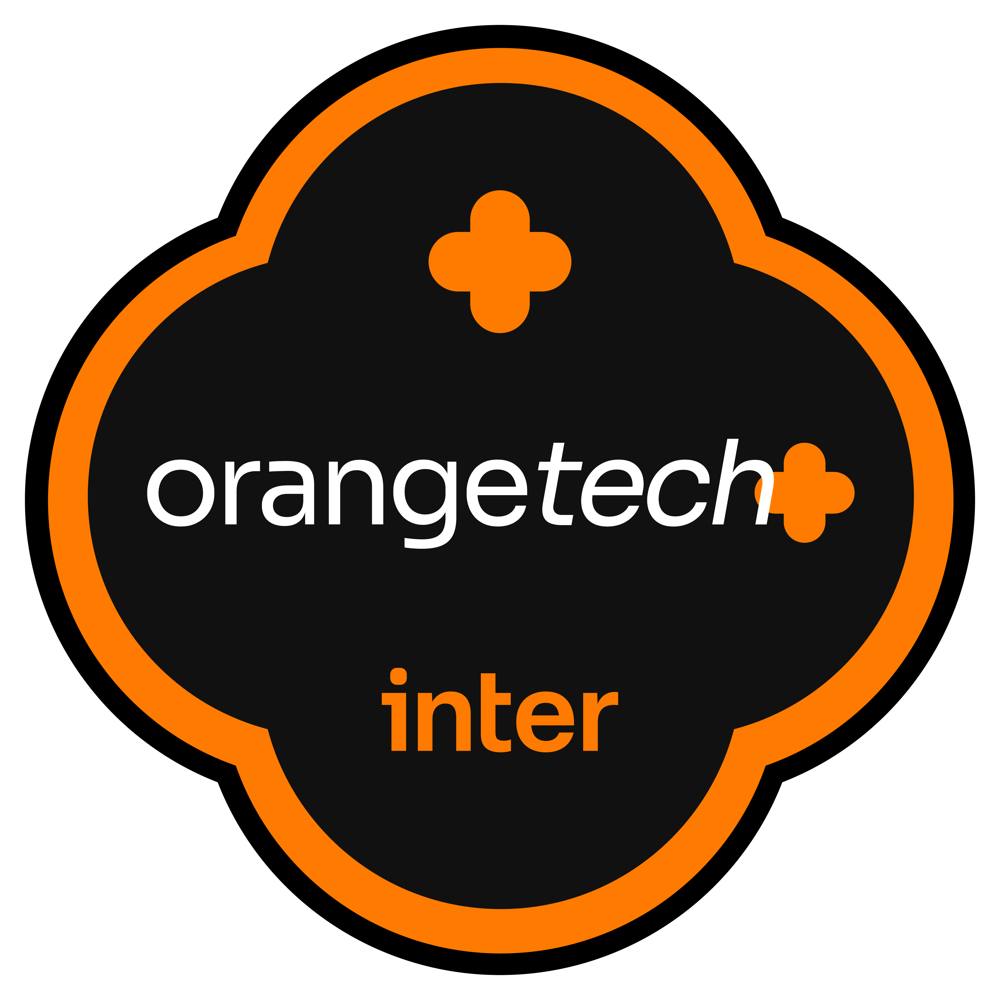
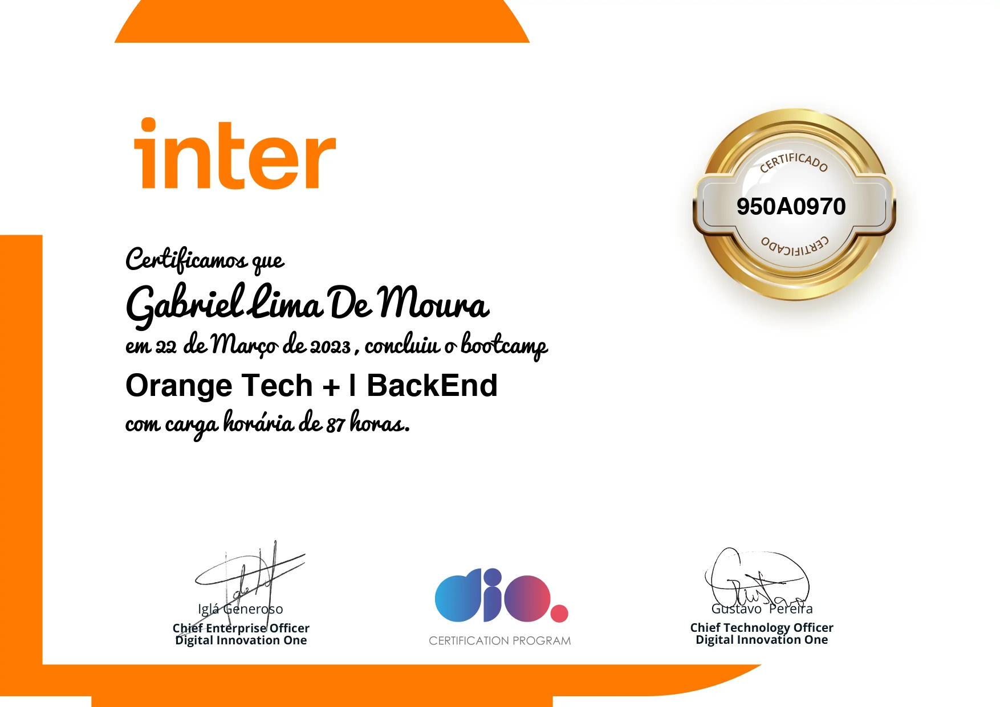

Repositório destinado ao conteúdo do Bootcamp - OrangeTech+BackEnd. 

<h1>

Orange Tech + | BackEnd</h1>

# Conteúdos estudados neste BootCamp.

##1 Prepare-se para a Jornada(Onboarding).
- [x] Conheça as Oportunidades da DIO.
- [x] Boas-vindas ao Orange Tech + | BackEnd.
- [x] Seja Protagonista Neste Bootcamp.
- [x] Convite para o minha Carreira Tech - Orange Tech + | BackEnd.
- [x] Introdução ao Desenvolvimento Moderno de Software.

 

##2 Princípios de Desenvolvimento de Software.
- [x] Introdução à Programação e Pensamento Computacional.
- [x] Introdução ao Git e ao GitHub.
- [x] Como entregar seu Desafio de Projeto.
- [x] Criando seu primeiro repositório no GitHub para Compartilhar seu Progresso.

 

##3 Conhecendo a Linguagem de Programação Java.
- [x] Introdução à Plataforma Java.
- [x] Ambiente de Desenvolvimento Java.
- [x] Aprendendo a Sintaxe Java.
- [x] Lógica Condicional e Controle de Fluxos em Java.
- [x] Estruturas de Repetição e Arrays em Java.
- [x] Entendendo Métodos Java.

 

##4 Dominando Algoritmos Básicos com Desafios de Código Java.
- [x] Desafio: Mesada do Sobrinho.
- [x] Desafio: Download de Pacotes.
- [x] Desafio: Leitura de Gertrudes.
- [x] Desafio: Lojinha de Doces.
- [x] Desafio: Industria da Multa.

 

##5  Programação Orientada a Objetos com Java.
- [x] Programação Orientada a Objetos com Java.
- [x] Trabalhando com Collections Java.
- [x] Debugging Java.
- [x] Tratamento de Exceções em Java.
- [x] Abstraindo um Bootcamp Usando Orientação a Objetos em Java.

 

##6 Ganhando Produtividade com Spring Framework.
- [x] Principais Protocolos de comunicação da internet.
- [x] Gerenciamento de dependências e build em Java com Maven.
- [x] Imersão no Spring Framework com Spring Boot.
- [x] Criando uma API REST documentada com Spring Web e Swagger.
- [x] Explorando Padrões de projetos na prática com Java.

 

##7 Dominando Algoritmos Intermediários com Desafios de Código Java.
- [x] Desafio: Salvando Música.
- [x] Desafio: Pontos na Carteira.
- [x] Desafio: Imóveis Disponiveis.
- [x] Desafio: Dc Monalds.
- [x] Desafio: Camarote do Blue Cold Ice Cubes.

 

##8 Fortalecendo sua Carreira Profissional.
- [x] Deixando seu Linkedin Atrativo.
- [x] Turbine seu Curriculo na DIO.
- [x] Trabalhando em Equipes Ágeis.
- [x] Transformando seu conhecimento em Artigos Técnicos.
- [x] Se preparando para uma entrevista.

 

# Bootcamp Concluído com Sucesso!

